# House Prices: Advanced Regression Techniques

## Introduction
In this data science project, the house prices on Kaggle competition is selected and the main task is to use training data set provided by Kaggle to train and optimize our model, and then use the model constructed and the testing data set to make prediction for the final house prices. We went through the whole process from preprocessing and exploratory data analysis to modeling and finally, make predictions. Below is a flowchart of the whole process:

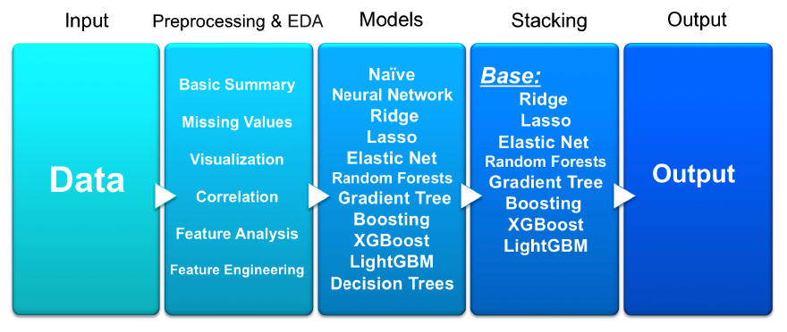

  

## Table of Contents
- Problem Overview
- Preprocessing and Exploratory Data Analysis
- Modeling 
- Simple Stacking Model Construction
- Summary and Improvement

## 1. Problem Overview
**Objective**
  - Predict sales price for each house given in the dataset (test.csv)

**Datasets**
  - train.csv: 1460 observations with 79 variables (sale price of each house and 78 variables describing different aspects of a house)
  - test.csv: 1459 observations with 78 explanatory variables

**Evaluation Metric**
  - Root-Mean-Squared-Error (RMSE) 

**Task Related**
  - EDA, Evaluation of Other Solutions, Modeling   

## 2. Preprocessing and EDA
### 2.1 Basic Summary of Data
  - head( ) & tail( ): Look at sample data
  - 1460*81(train) & 1459*80(test) 
  - 35 numeric variables (exclude SalePrice) & 43 categorical variables  
  - describe( ):summary statistics 

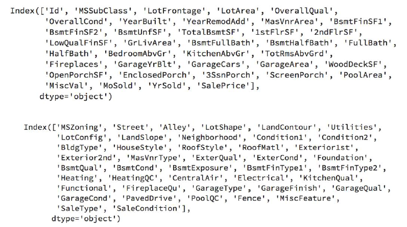

  

### 2.2 Missing Values
  - Replaced with “None”, 0, Median, Mode (Categorical Variables)

### 2.3 Visualization & Correlation Analysis
  - **Histograms for Dependent Variable**
    - It can be seen that the plot is right skewed. In order to build a linear model, it is necessary to transform it into normally distributed. Here we use log transform and the result is shown below on the right. Meanwhile, from calculation we found that the skewness for the sale price data is 1.8829 and Kurtosis is 6.5363.

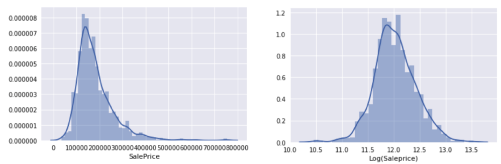

  

  - **Calculate Correlation Coefficient**
    - OverallQual, GrLivArea, GarageCars, GarageArea, TotalBsmtSF (Top 5 variables that have the largest pairwise correlation with sale price)

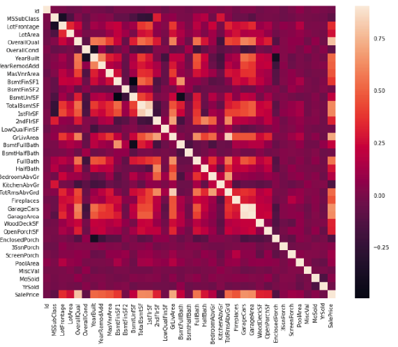

  

  - **Boxplot for key categorical features** 

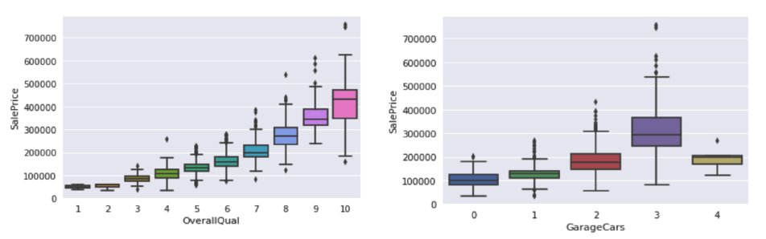

    
    
  - **Scatter plot for key numeric features**

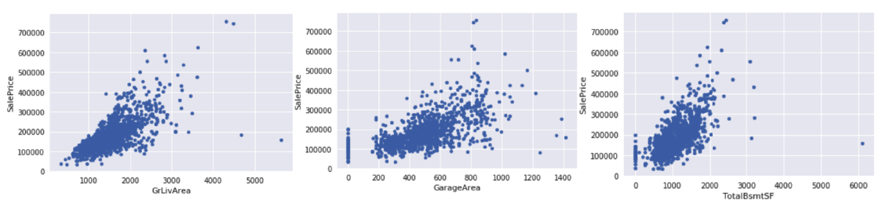

  

### 2.4 Feature Analysis & Engineering
  - **Outliers** 
    - From the scatter plot of SalePrice with GrLivArea and TotalBsmtSF, it is found that there are some outliers in these two plot. In the first plot, the two values with bigger 'GrLivArea' seem strange and they are not following the crowd; In the second plot, there is one value with bigger ‘TotalBsmtSF’ not following the crowd. As a result, these outliers in training set are deleted.

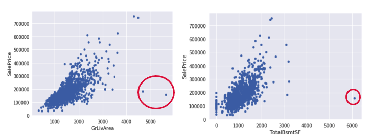

  

  - **Feature Creation** 
    - From the result of correlation coefficient calculated between variables and sale price (figure below), it can be seen that features that are related to area are highly correlated with sale price. Thus a new feature named ‘TotalSF’ (measured as the sum of 'TotalBsmtSF', '1stFlrSF' and '2ndFlrSF') meaning “total square feet” is created. Meantime, a new feature named ‘Total_House_Quality’ (measured as sum of 'OverallQual' and 'OverallCond') is created.

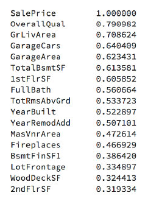

  

 - **Feature Type Transformation, Log Transformation**
   - By analyzing the meaning and data types of the independent variables, it can be seen that some numeric variables that have special meaning should be transformed into categorical variables.
   - For real-world data, there are a lot of features that are heavily skewed. Transformation technique is useful to stabilize variance, make the data more normal distribution-like, improve the validity of measures of association. Hence we transformed the skewed numeric features by taking log(feature + 1).

- **Label Encoding & Dummy Variables**
  - For some categorical variables that may contain information in their ordering set, Label Encoding (which is a utility class to help normalize labels such
that they contain only values between 0 and n_classes-1) is used on these features.
  - Create dummy variables for all the categorical features in the dataset.

## 3. Modeling
In the modeling part, there are 10 models in total have been used for the training dataset: Naïve Model, Neural Network, Ridge, Lasso, Elastic Net, Random Forests, Gradient Tree Boosting, XGBoost, LightGBM, Decision Trees. Overall the Naïve Model performs very bad, followed by Decision Trees and Random Forests. There is much possibility for Neural Network to get a great performance. The other 7 models have pretty same level of performance. Among all these
models, Lasso is the best model for the training dataset and has the lowest RMSE.

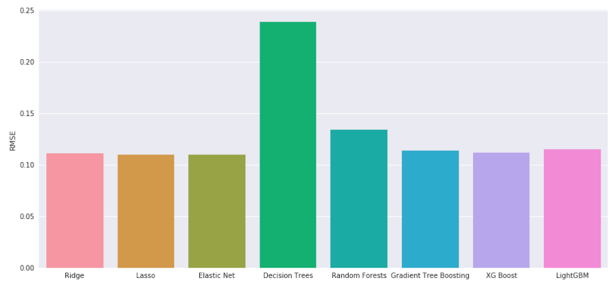

 

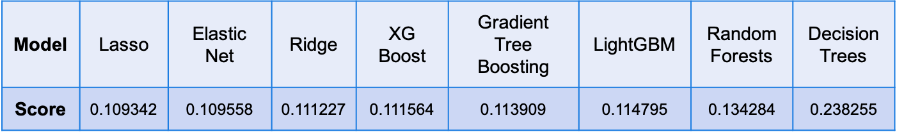

 

## 4. Simple Stacking Model Construction
Model stacking is an efficient ensemble method in which the predictions generated by using various machine learning algorithms, are used as inputs in a second-layer learning algorithm. Then the second-layer is trained to optimally combine the model predictions to form a new set of predictions. These can be used on additional layers, or the process can stop here with a final result (figure below). This method is commonly used to boost predictive accuracy. In other words, ensemble stacking can be referred to as blending since all the numbers are blended to produce a prediction or classification.

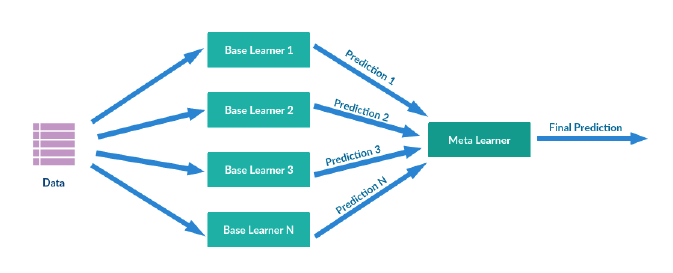

 

The simplest stacking method is the unweighted average of the prediction of the base models, in which the sum of the predicted values of all base models are divided by number of base models. In an unweighted average, each model takes the same weight when an ensemble model is built. There is another method using weighted averages of the prediction of the base models. In my modeling process, I used the simple stacking method (using unweighted averages) to make final predictions.

My first trial is to use all the eight models as base model to build the stacking model by taking average of the prediction results：

**stacked = (ridge_pred + lasso_pred + elasticnet_pred + rf_pred + gtb_pred + xgb_pred + lgb_pred + dtree_pred) / 8**

In the first submission on Kaggle, the score is 0.14440. Then we dropped the decision trees since it has very bad performance for the training dataset. We use the same stacking method to get the final prediction and then the second submission gave us the core of 0.14287, which is better than the first submission. Then we keep dropping the random forests (as it did not perform well for training dataset) and used the left 6 base model to build the stacking model. This time the score on Kaggle became to 0.15035, which is worse than the second submission. The summary of these three submission is shown in table 4. Finally we choose the stacking model used in submission two as our final model, which are: Ridge, Lasso, Elastic Net, Random Forests, Gradient Tree Boosting, XGBoost, LightGBM. The final stacked model is described as:

**stacked = (ridge_pred + lasso_pred + elasticnet_pred + rf_pred + gtb_pred + xgb_pred + lgb_pred) / 7**

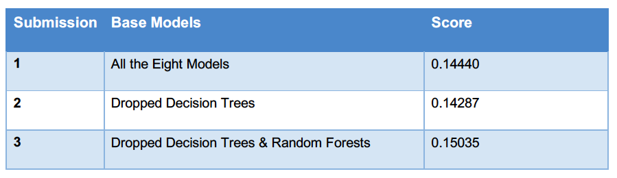

 

## 5. Summary and Improvement
In this project, I started with preprocessing and exploratory data analysis, where steps such as basic summary, data cleaning, visualization and correlation analysis, feature analysis and engineering are included in this section and data are well prepared for modeling. Then I tried many different algorithms and used the RMSE as the main evaluation for model performance. Finally, some important base models are chosen based on their individual performance on the training data set and then are combined into the stacking model and get the final prediction results.

The performance of the final stacking model I constructed is not satisfying. However, there is still much room for improvement. This project opens several avenues for future work. Since data processing is a very important part before modeling process, more advanced technologies can be tried in this section such as in detecting outliers, feature selection. As for modeling section, it is necessary to try other methods for parameter tuning. We also need to check if there
are any problems of overfitting. Different algorithms are also good choice for improving the performance and we may also try more complicated stacking model to improve the performance of our model.

